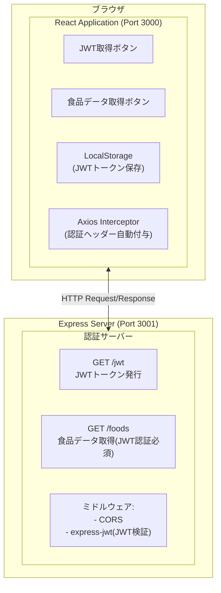
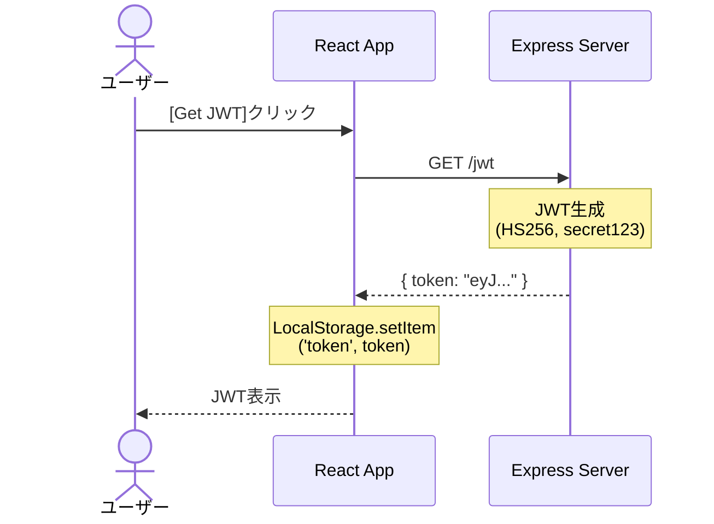
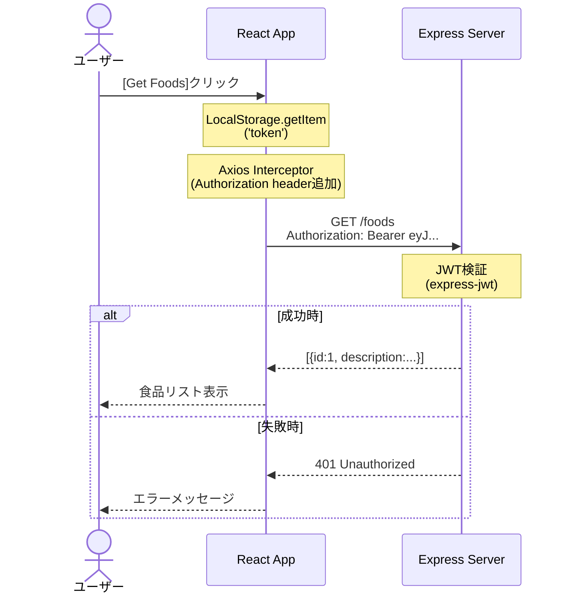

# React Cookie内でJWTを取り扱うサンプルアプリ

## 概要

本プロジェクトは、ReactアプリケーションでJWT（JSON Web Token）を使用した認証の実装例を示すサンプルアプリケーションです。

### 主な特徴
- **フロントエンド**: React + TypeScript
- **バックエンド**: Express.js（JWT発行・検証サーバー）
- **認証方式**: JWT（HS256アルゴリズム）
- **ストレージ**: LocalStorage（JWTトークンの保存）
- **通信**: Axios（HTTPクライアント）

### 技術スタック
- React 19.2.3
- TypeScript 5.9.3
- Express.js 4.21.2
- jsonwebtoken 9.0.2
- express-jwt 8.5.1
- axios 1.7.9

## システム構成図



## 機能一覧表

| No | 機能名 | エンドポイント | メソッド | 認証 | 説明 |
|----|--------|--------------|---------|------|------|
| 1 | JWTトークン取得 | `/jwt` | GET | 不要 | ユーザー情報を基にJWTトークンを発行 |
| 2 | 食品データ取得 | `/foods` | GET | 必要 | JWT認証後、食品リストを返却 |

### フロントエンド機能
| 機能 | 説明 |
|------|------|
| JWT取得 | サーバーからJWTトークンを取得し、LocalStorageに保存 |
| 食品データ取得 | JWTトークンを使用して保護されたAPIから食品データを取得 |
| Axios Interceptor | 全てのAPIリクエストに自動的にJWTトークンをAuthorizationヘッダーに付与 |
| エラーハンドリング | 認証エラーやネットワークエラーを表示 |

## 機能毎の処理シーケンス図

### 1. JWTトークン取得フロー



### 2. 保護されたリソース取得フロー



## 動かし方

### インストール

```bash
yarn
```

### ビルド

```bash
yarn build
```

### フロントエンドの起動

```bash
yarn start
```

### JWT発行用のサーバー起動

```bash
yarn server
```

